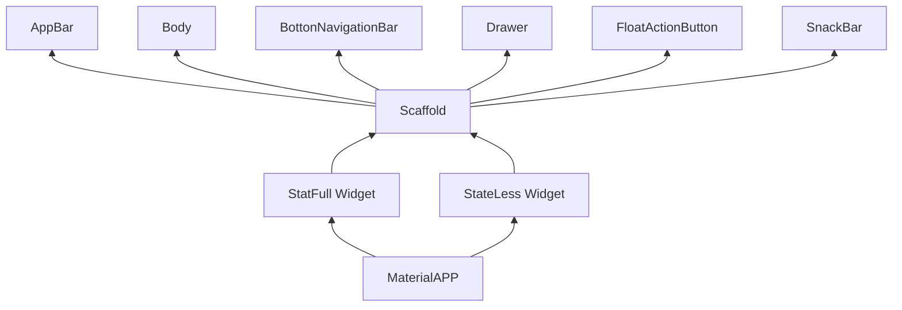

<<<<<<< HEAD
<<<<<<< HEAD
# AULA DO DIA 27/01
=======
## AULA DO DIA 27/01
# Configuração das máquinas de uso pessoal
>>>>>>> 216224e5b5662d545ff75b68f929a8330af921b4
=======
## AULA DO DIA 27/01
# Configuração das máquinas de uso pessoal
>>>>>>> 216224e5b5662d545ff75b68f929a8330af921b4

    Criamos um perfil próprio para usarmos no computador da escola, tivemos o acesso para criar e configurar uma conta própria para a utilização durante todas as aulas desse ano.
    Foi definido que o nome dessa conta seria "2DevSESI" e a sua senha seria "tecdev2026", além disso, tivemos acesso à senha de acesso a conta do instrutor: "sesisenaisp".

    Após inicializar o computador, fizemos a configuração do Git, um espaço na máquina onde estaria "guardado" todos os códigos desenvolvidos durante a aula. OS códigos utilizados foram os:
        -git config --global user.email"lucascombinato@gmail.com"   //conectar o git ao gitHub através no e-mail conectado
        -git config --global user.name"LucasGatoBigato"     //conectar o git ao gitHub através no nome de usuário conectado
        -git config --list     //lista todas as configurações do Git

    Fora isso, aprendermos certas configurações direto pelo CMD, sendo eles:
        cd {nome da parta}   -->   Para abrir a pasta citada
        dir   -->   Mostra todos os arquivos do diretório
        mkdir [nome do diretório]   -->   Cria uma nova pasta com determinado nome
        type nul > {nome do arquivo}   -->   cria um arquivo novo de texto

<<<<<<< HEAD
<<<<<<< HEAD
## Conteúdo da Aula Anterior

## Introdução ao Desenvolvimento Mobile
=======

## AULA DO DIA 03/02
# Introdução ao Desenvolvimento Mobile
>>>>>>> 216224e5b5662d545ff75b68f929a8330af921b4
=======

## AULA DO DIA 03/02
# Introdução ao Desenvolvimento Mobile
>>>>>>> 216224e5b5662d545ff75b68f929a8330af921b4

### TIPOS DE DESENVOLVIMENTO

    - NATIVO
        • Android
            - SDK: Android SDK
            - IDE: Android Studio
            - Linguagens: Kotlin e Java
            - Ambientes: Mac / Windows / Linux

        • iOS:
            - SDK: Cocoa Touch
            - IDE: Xcode
            - Linguagens: Swift / Objectype-C
            - Ambientes: Mac

<<<<<<< HEAD
<<<<<<< HEAD
    - MULTIPLATAFORMA   -->   //Uma linguagem de desenvolvimentos em várias plataformas
        - React Native:
=======
    - MULTIPLATAFORMA
        • React Native:
>>>>>>> 216224e5b5662d545ff75b68f929a8330af921b4
=======
    - MULTIPLATAFORMA
        • React Native:
>>>>>>> 216224e5b5662d545ff75b68f929a8330af921b4
            - SDK: Node.JS
            - IDE: VSCode / etc.
            - Linguagens: JavaScript / TypeScript
            - Ambientes: Mac / Windows / Linux

<<<<<<< HEAD
<<<<<<< HEAD
        - Flutter:   -->   Framework
=======
        • Flutter:
>>>>>>> 216224e5b5662d545ff75b68f929a8330af921b4
=======
        • Flutter:
>>>>>>> 216224e5b5662d545ff75b68f929a8330af921b4
            - SKD: Flutter SDK
            - IDE: VSCode / Android Studio
            - Linguagens: Dart
            - Ambientes: Mac / Windows / Linux

# AULA DO DIA 10/02

## Preparação do Ambiente de Desenvolvimento

### Instalação do flutterSDK
    - Download do arquivo ZIP na página flutter.dev
    - Inclusão do flutter na pasta |C:\src|
    - Inclusão do |flutter/bin| nas variáveis de ambiente
    - Teste o |flutter --version|

### Instalação do AndroidSDK
    - Download do Android SDK - Command Line Tools
    - Adicionar o Command-line ao C:\src\AndroidSDK
    - Adicionar o SDKManager às Variáveis de Ambiente
    - Download dos pacotes
        - Emulador
        - Plataforms
        - Plataforms-tools
        - Build-tools
    - Adicionar ADB e o Emulador às Variáveis de Ambientebikini slit
    - Criação da Imagem do Emulador - via SDKManager
    - Build do Emulador - via SDKManager

### Criação de Projetos e Códigos da Linha de Comando

- criação de projetos
    - `flutter create nome_do_app`
        - flags(parâmetros):
            - `--empty` : Cria um aplicativo "vazio"(hello World!)
            - `--platforms` : permite a seleção de uma plataforma de desenvolvimento
                - ex: --platforms=android (a criação do projeto será somente para a plataforma android)
    - exemplo de criação de uma aplicativo android vazio
        - flutter create nome_do_app --empty --platforms=android
        - obs: nome do aplicativo: todas as letras minúsculas, separação de palavras com "_";
    - `flutter doctor`
        - permite correção de pequenos problemas no flutter e identificação dos parâmetros funcionais em relação as plataforma de desenvolvimento
        - sempre rodar o flutter doctor no começo do desenvolvimento
    - `flutter clean`
        limpa cache do build(apaga o apk anterior)
    - `fluter run -v`
        - build do app (apk)

- Gerenciamento de dependências do PubSpec()
    - Instalação
        - `flutter pub add nome_dependência`
    - Baixar e instalar dependências projetadas
        - `flutter pub get`
    - Outros comandos do flutter pub(dependências)
        - `flutter pub outdated` (verifica de as dependências estão desatualizadas)
        - `flutter pub upgrade` (atualiza as dependências do flutter pub)

## Estrutura de um Aplicativo

### A Hierarquia de árvore

#### Gráfico com demonstração da Hierarquia

